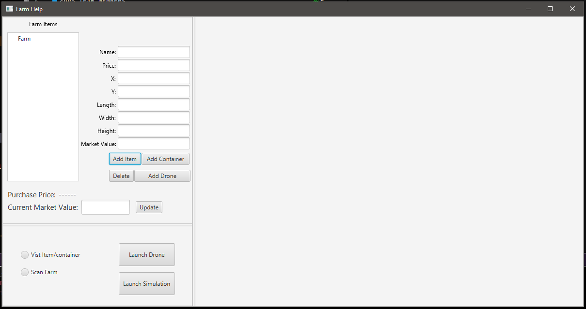

# Farmer Application

CS 420 Undergraduate Team 6

  TEAM MEMBERS
 Carter Bellew
 Diego Garcia Hernandez
 Kareem Hammad
 Michael Hurt
 Soomin Im

## Presentation

#GITLAB NOTE

Project was modified multiple times in the course of 
the GitLab commits. At a random time of attempting 
to commit, the entire list of commits disappeared
from the main branch project repository. After investigating,
commits were found to be migrated to the 'diego' branch.
More commits were added after commits disappeared 
to each branch and main branch as well.

# GITLAB REPO

https://gitlab.cs.uab.edu/cs420_farmerApp/FarmerApp.git

# RUNNING PROGRAM

  *  Requirements: Eclipse or Intellij
  *  JAVA SDK: 1.8 or 8
  *  Java must be preinstalled into the computer from Oracle source
    
    In order for user to run this program, the user must ensure the src
    package is set as the root. src package is ensured to be set as root 
    to prevent issues. main.java file under package hierarchy src/ch/makery/address/
    is the main java class. 
    
    User can run application by navigating to main java file. and using Run.main()
    
    User can prompt the drone to fly/animate by clicking the "Launch Simulation" button.
	* The Scan Farm Radio Button will prompt the Drone to scan the perimeter
	* Visit Item/container will make the drone fly to where an item or item container is
		NOTE: An item or an item container must first be created
    
    User can prompt for real drone to fly by clicking the "Launch Drone" button
    * The Scan Farm Radio Button will prompt the Drone to scan the perimeter
	* Visit Item/container will make the drone fly to where an item or item container is

    User can add item container using the "add item container" and inputting the prompted
    information. This information determines the parameters of the item container when creating for
    farm map.
    
    User can add item container using the "add item" and inputting the prompted
    information. This information determines the parameters of the item farm when creating for
    farm map.
    
    A tree view is provided to provide visual representation of item and item container relations

    Delete button allows user to delete an item or item container from tree view.

    The drone test class functions to check functionality of the adapter and its methods. Functionality can be checked without connecting to actual drone
    If drone is connected a seperate method is used to send commands to the drone.

    